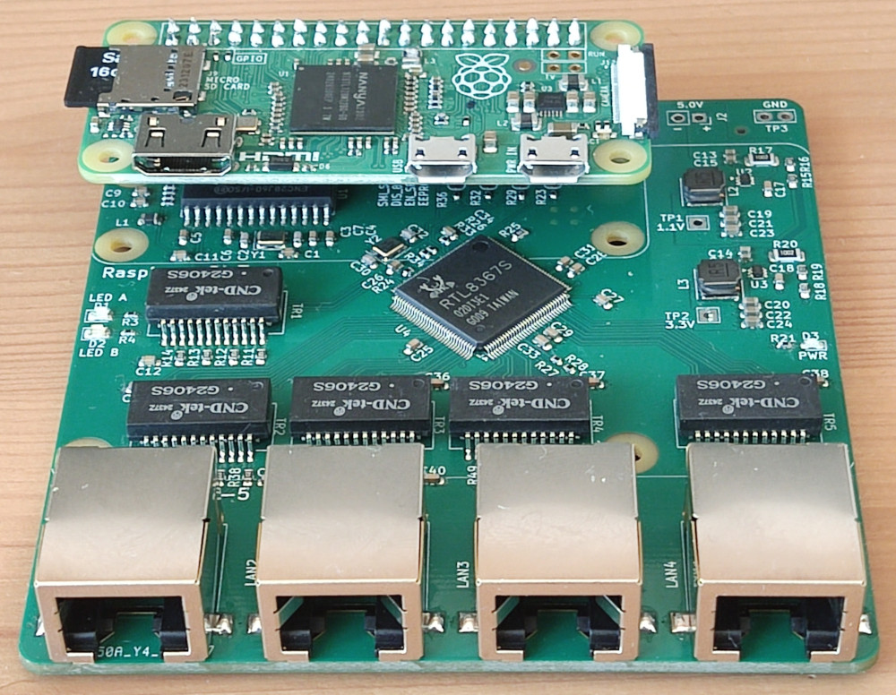
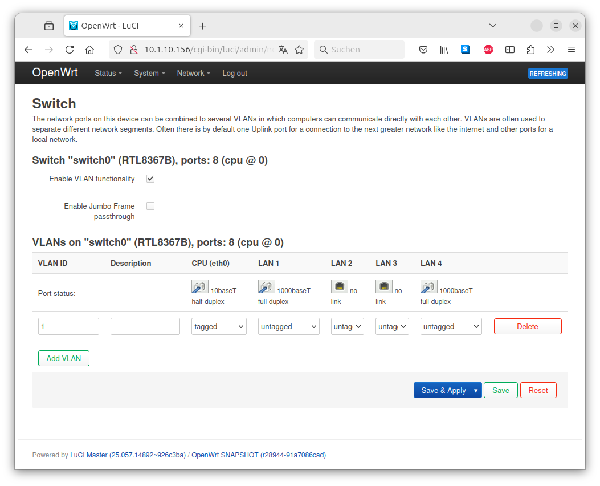
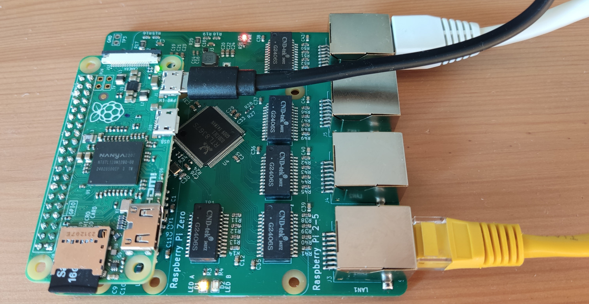

# 4-Port Managed Switch

An open-source 4-port gigabit managed switch HAT based on a Raspberry Pi with OpenWrt support.

**Disclaimer:** This is an ongoing project where some features are not working, and some hardware bugs may exist.



## Features
* 4 Gigabit Ethernet RJ45 ports  
* Supports Raspberry Pi 1–5 (including Raspberry Pi Zero 1–2)  
  - Tested with a Raspberry Pi Zero 1  
  - Raspberry Pi 5 is not working with OpenWrt due to this [issue](https://github.com/openwrt/openwrt/issues/18034)  
* Works with a [custom OpenWrt](https://github.com/AlbrechtL/rpi-managed-switch-openwrt/tree/rpi_managed_switch)  
* Two overlays:  
  1. For Linux [Distributed Switch Architecture (DSA)](https://www.kernel.org/doc/Documentation/networking/dsa/dsa.txt)  
  2. For OpenWrt [swconfig](https://openwrt.org/docs/techref/swconfig)  
* VLAN support (only on OpenWrt with swconfig)
* Hardware offloading support (only on OpenWrt with swconfig)
* Hardware design in KiCad
* Ready for JLCPCB production
  - Using a much as possible basic parts to lower the assembling costs

## Software Status

The hardware works with a modified OpenWrt:  
https://github.com/AlbrechtL/rpi-managed-switch-openwrt/tree/rpi_managed_switch

I added the following to OpenWrt:  
* Two device tree overlays (for swconfig and DSA)  
* Enabled the ENC28J60 driver  
* Added a small patch to enable the ENC28J60 for DSA  
* Added detection of swconfig or DSA in the first boot scripts so that OpenWrt uses the switch  

See the differences:  
https://github.com/openwrt/openwrt/compare/main...AlbrechtL:rpi-managed-switch-openwrt:rpi_managed_switch  

To communicate with the RTL8367S switch chip, two different Linux drivers are available:  

**1. OpenWrt swconfig**

Driver: `drivers/net/phy/rtl8367b.c`
* Pros:  
  - Full hardware offloading support  
  - VLAN support  
* Cons:  
  - OpenWrt-specific  
  - OpenWrt is transitioning from swconfig to DSA  

OpenWrt Screenshot  
  

**2. Distributed Switch Architecture (DSA)**

Driver: `drivers/net/dsa/realtek/rtl8365mb.c`
* Pros:  
  - Integrated into the Linux kernel  
  - Mainline RTL8367S support  
  - Works on Raspberry Pi OS with a custom Linux kernel  
* Cons:  
  - No hardware offloading support  
  - No VLAN support  

There was a discussion on the Linux kernel mailing list about the missing hardware offloading and VLAN support:  
https://lkml.iu.edu/hypermail/linux/kernel/2407.0/01589.html  

Working DSA Example:
```
root@OpenWrt:~# ip addr
1: lo: <LOOPBACK,UP,LOWER_UP> mtu 65536 qdisc noqueue state UNKNOWN qlen 1000
    link/loopback 00:00:00:00:00:00 brd 00:00:00:00:00:00
    inet 127.0.0.1/8 scope host lo
       valid_lft forever preferred_lft forever
    inet6 ::1/128 scope host 
       valid_lft forever preferred_lft forever
2: eth0: <BROADCAST,MULTICAST,UP,LOWER_UP> mtu 1508 qdisc fq_codel state UP qlen 1000
    link/ether b8:27:eb:8f:43:df brd ff:ff:ff:ff:ff:ff
    inet6 fe80::ba27:ebff:fe8f:43df/64 scope link 
       valid_lft forever preferred_lft forever
3: lan1@eth0: <BROADCAST,MULTICAST,UP,LOWER_UP> mtu 1500 qdisc noqueue master switch state UP qlen 1000
    link/ether b8:27:eb:8f:43:df brd ff:ff:ff:ff:ff:ff
4: lan2@eth0: <NO-CARRIER,BROADCAST,MULTICAST,UP> mtu 1500 qdisc noqueue master switch state DOWN qlen 1000
    link/ether b8:27:eb:8f:43:e0 brd ff:ff:ff:ff:ff:ff
5: lan3@eth0: <NO-CARRIER,BROADCAST,MULTICAST,UP> mtu 1500 qdisc noqueue master switch state DOWN qlen 1000
    link/ether b8:27:eb:8f:43:e1 brd ff:ff:ff:ff:ff:ff
6: lan4@eth0: <BROADCAST,MULTICAST,UP,LOWER_UP> mtu 1500 qdisc noqueue master switch state UP qlen 1000
    link/ether b8:27:eb:8f:43:e2 brd ff:ff:ff:ff:ff:ff
7: switch: <BROADCAST,MULTICAST,UP,LOWER_UP> mtu 1500 qdisc noqueue state UP qlen 1000
    link/ether b8:27:eb:8f:43:df brd ff:ff:ff:ff:ff:ff
    inet6 fe80::ba27:ebff:fe8f:43df/64 scope link 
       valid_lft forever preferred_lft forever
8: switch.1@switch: <BROADCAST,MULTICAST,UP,LOWER_UP> mtu 1500 qdisc noqueue state UP qlen 1000
    link/ether b8:27:eb:8f:43:df brd ff:ff:ff:ff:ff:ff
    inet 192.168.1.1/24 brd 192.168.1.255 scope global switch.1
       valid_lft forever preferred_lft forever
    inet6 fd8d:3fdb:486f::1/60 scope global noprefixroute 
       valid_lft forever preferred_lft forever
    inet6 fe80::ba27:ebff:fe8f:43df/64 scope link 
       valid_lft forever preferred_lft forever
```

## Hardware Status

I have two assembled PCBs that have basic functionality. See [issues](https://github.com/AlbrechtL/rpi-managed-switch-4-port/issues) for a list of hardware problems.



## Performance

I don't have detailed performance measurements yet, but here are some bandwidth indications:  
* **RJ45–RJ45 with OpenWrt swconfig:** ~1 Gbit/s (wire speed, full-duplex)  
* **Raspberry Pi to RJ45 (CPU port):** ~5 Mbit/s (half-duplex)  
  To support the inexpensive Raspberry Pi Zero, an external SPI Ethernet chip (ENC28J60) is used to connect to the main switch chip (RTL8367S). Due to the slow SPI interface, only ~5 Mbit/s can be achieved. However, for a managed web interface, that's sufficient.  
* **RJ45–RJ45 with DSA:** ~2 Mbit/s  
  Currently, the RTL8367S DSA driver doesn't support hardware offloading. As a result, all traffic is routed through the Raspberry Pi and the very slow SPI interface. For a switch, this is not acceptable.  

## Acknowledgements

I would like to thank the following open-source projects. Without these great works, this open-source switch would not be possible:  
* [OpenWrt](https://openwrt.org/)  
* RTL8367S Managed Switch  
  - Blog post: https://blog.brixit.nl/making-a-linux-managed-network-switch/  
  - KiCad: https://github.com/FOSDEM/video/tree/master/hardware/pcbs/switch_board  
* ENC28J60 on a Raspberry Pi Zero  
  - Hackster: https://www.hackster.io/lightside-instruments/the-ethernet4pizero-ethernet-for-raspberry-pi-zero-shield-dd4316  
  - KiCad: https://github.com/lightside-instruments/ethernet4pizero.git  
* [RPI5-CFE-Hat](https://github.com/will127534/RPI5-CFE-Hat)  
* [PCIe3_Hub](https://github.com/will127534/PCIe3_Hub)  
* [RouterPi](https://github.com/ZakKemble/RouterPi)  
